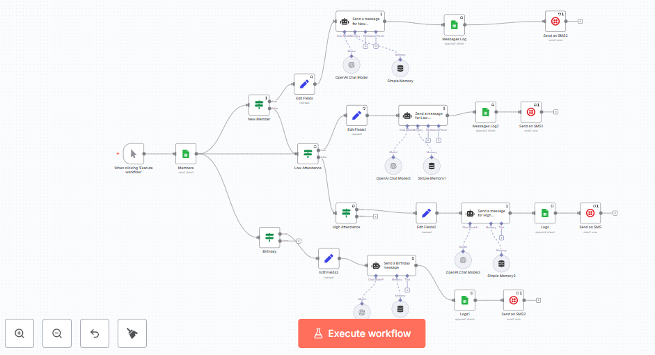

**Gym Wellness & Retention AI Agent**

**Project Overview**

This project builds a full Gym Wellness & Retention AI System that combines:

* **Synthetic behavioural data generation**
* **A machine learning model (logistic regression)** that predicts the probability of a “bad day tomorrow”
* **A Large Language Model (LLM)** that generates personalized wellness explanations, 3-day micro-plans, and structured service recommendations
* **An automation workflow (n8n + Google Sheets + Twilio)** that sends personalized SMS/WhatsApp retention messages

**The goal is to:**

* Estimate member wellbeing risk using 7-day behavioural windows
* Translate numerical risk into human-friendly coaching plans
* Recommend one structured service offer from a fixed list
* Automate retention campaigns (new members, low attendance, high attendance, birthdays)
* Provide gyms with a scalable AI blueprint for engagement and retention

**Dataset**

All datasets are located in the `/data/` folder.

**profiles.csv**
* Static member characteristics (age, sex, goal)
* Baseline wellbeing traits (sleep, stress, mood)
* Behaviour volatility scores

**checkins.csv**
* Daily mood, stress, fatigue
* Sleep hours
* Activity minutes
* Label: `bad_day_tomorrow`

**AI Fitness dataset – Members.csv**
* Used by n8n for segmentation (attendance, tone, preferred workout)

**AI Fitness dataset – Logs.csv**
* Logged messages sent by n8n + OpenAI

**daily_plans_output.csv**
* Example LLM-generated wellness plans

**Feature Engineering**

Each member-day is transformed into a 7-day behavioural window:

* **mood_avg_7d**
* **stress_avg_7d**
* **fatigue_avg_7d**
* **sleep_avg_7d**
* **activity_days_7d**
* **sleep_debt_7d**

These represent weekly patterns that drive readiness.

**Machine Learning Model**

A logistic regression model predicts:

*P(bad_day_tomorrow = 1 | last 7 days)*

**Risk Mapping**

* LOW: score < 0.4 → performance strategy
* MEDIUM: 0.4–0.7 → balanced strategy
* HIGH: score ≥ 0.7 → recovery strategy

The ML output directly conditions the LLM behaviour.

**LLM Coaching System**

**1. Natural-Language Summary**

Numerical features are translated into readable interpretations:

* “sleep was short this week”
* “fatigue is high”
* “activity was low”

**2. Risk Explanation**

* GPT provides an empathetic explanation of the member’s current state
* Avoids numerical language or technical terms

**3. Personalized 3-Day Micro-Plan**

Each plan includes:

* Sleep targets
* Activity recommendations
* Stress-management techniques

**4. Service Recommendation**

Chosen from a fixed list:

* yoga class
* mobility class
* pilates session
* personal training session
* nutrition consultation
* stress-coaching session

This ensures structured outputs for Power BI analytics.

**Automation Workflow (n8n)**

Below is the operational retention workflow:

The workflow handles:

* New member welcome messages
* Low attendance encouragement
* High attendance recognition
* Birthday messages with offers

With OpenAI generating text and Twilio sending messages.

**Power BI Dashboard**

The dashboard helps analyze:

* Service recommendation frequency
* Risk level segmentation
* Attendance categories
* Message logs

**Download the full dashboard (PDF):**  
[gym.ai_powerbi.pdf](./dashboards/gym.ai_powerbi.pdf)

**Folder Structure**
project-root/
│
├── dashboards/
│   └── gym.ai_powerbi.pdf
│
├── data/
│   ├── AI Fitness dataset - Logs.csv
│   ├── AI Fitness dataset - Members.csv
│   ├── checkins.csv
│   ├── daily2_plans2_2025-05-05.csv
│   └── profiles.csv
│
├── images/
│   └── retention_Agent.png
│
├── notebook/
│   └── Wellness_agent_project.ipynb
│
├── report/
│   └── report_ai agent project.pdf
│
├── src/
│   ├── dataset_generation.ipynb
│   └── gym_retention_Agent.json
│
└── README.md

**Future Work**

* Integrate real gym CRM data
* Add tree-based or survival models
* Build a coach-in-the-loop approval interface
* Add push notifications or in-app messaging
* Track member response to improve recommendations

**Conclusion**

This project brings together synthetic behavioural data, machine learning, LLM-generated coaching, workflow automation, and business intelligence tools into a single integrated framework. The result is a practical and adaptable system that gyms can use to understand member wellbeing, deliver personalized support, and automate key communication processes. Although built on synthetic data, the architecture mirrors real-world operations and can be transferred to production environments with minimal changes, offering a strong foundation for improving member engagement, wellbeing, and service utilization.
